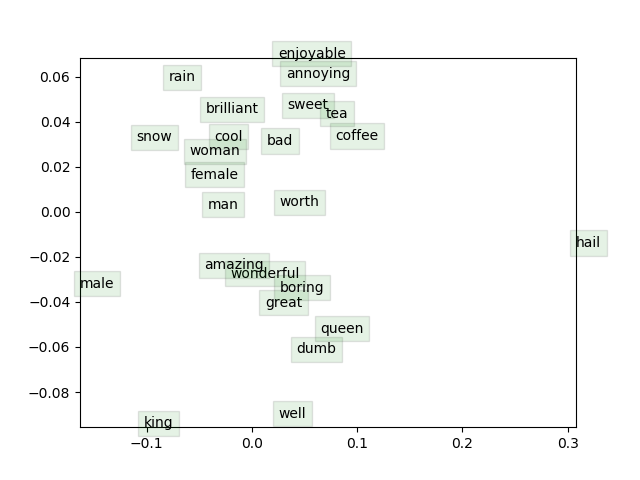

# Stanford CS224n Winter 2019
###### Natural Language Processing with Deep Learning - Assignment Solutions

Read the handout PDFs in each assignment folder for instructions and details.

### Results Showcase

#### Assignment 1

Please see the [Notebook](a1/exploring_word_vectors.ipynb).

#### Assignment 2

Plot of Word Vector Space.

#### Assignment 3

* DEBUG = True [Output Log](a3/debug_true_output.txt).
  * Best Avg Train Loss - 0.116
  * Best Dev UAS - 73.76

* DEBUG = False [Output Log](a3/debug_false_output.txt).
  * Best Avg Train Loss - 0.058
  * Best Dev UAS - 88.78
  * Best Test UAS - 88.91

#### Assignment 4 and 5

Coming Soon!
